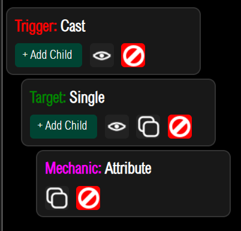

# 属性功能

## 给予属性

属性需要写在MythicMobs的配置文件里
```yaml
属性测试:
  Type: PIG
  Display: '&a测试怪物'
  Health: 100
  Damage: 2
  psk-attribute:
    - "基础防御 10000"
```
是的 如图所示 属性节点就是 `psk-attribute`

## 其他方式给予属性？

当然你也可以通过SkillAPI的方式进行给予属性



通过组件 **Attribute** 来给予目标临时属性也是可以的
