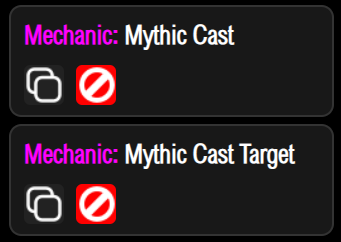

# 技能功能

这分为两部分
1. 使用MM释放SkillAPI
2. 使用SkillAPI释放MM技能

## 使用MM释放SkillAPI
这是一个MM的技能组件语法如下
```yaml
castskillapi{name="技能名",level="技能等级"} @Self
```
注意这里是 @Self 以MM实体为触发目标

技能的选择器要写在技能里

## 使用SkillAPI释放MM技能


关于整个功能有两个组件 
### MythicCast
让被SkillAPI选择器选定的目标释放MythicMobs的技能组

### MythicCastTarget
让技能释放者释放一个MM技能 这个技能的目标继承自SkillAPI技能选择器
