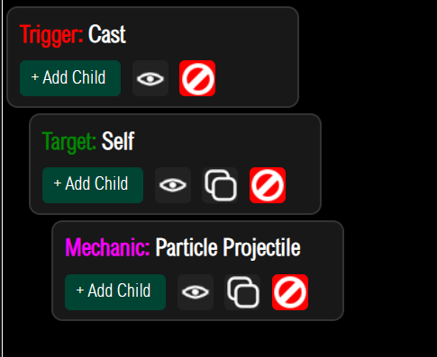
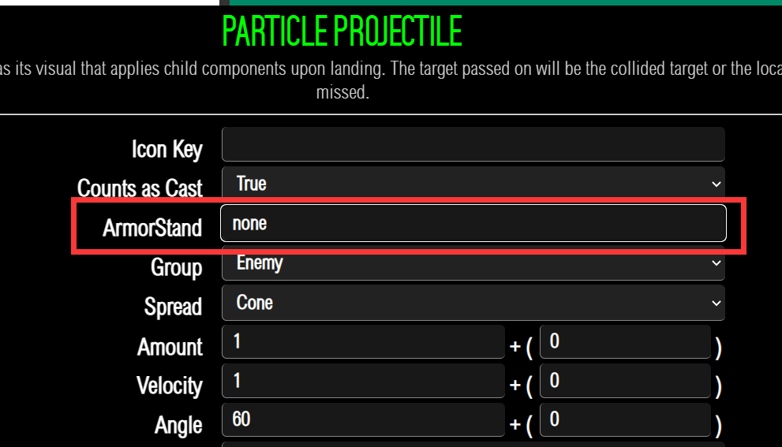
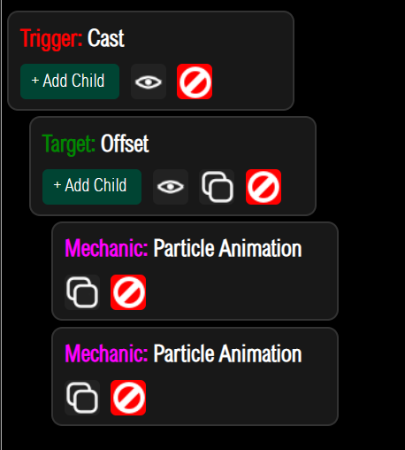

# 开始使用

****

我们新建一个技能 需要使用[专用编辑器](https://fxrayhughes.github.io/ProSkillAPI/)

这是一个最基础的格式

接下来就编辑ArmorStand就可以了

这里的写法: 

+ none 代表不使用
+ 这里写盔甲架的名称

接下来你的盔甲架就会跟随你的粒子弹道进行移动

但是你的粒子将不会显示

若想同时显示粒子与盔甲 请写两个动作 同时执行

一个播放盔甲架 一个播放粒子特效