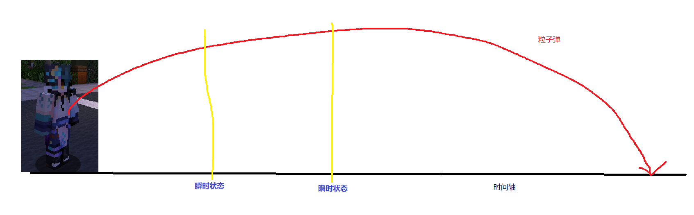

# 功能介绍

****

### 本功能依赖
1. 拓展包ProjectA
2. Adyeshach2.x

我们知道 粒子弹(ParticleProjectile) 和 粒子动画(ParticleAnimation)

都会因为渲染顺序产生空间坐标

本模块就是利用这个瞬时状态进行操作

生成一个盔甲架 在每个瞬时状态节点进行移动 并且修正视角

[效果演示视频](https://xv5zac7cto.feishu.cn/docx/DanVdl9mbovy0txqSj9cirb1n0T)

接下来我会说明这是怎么做的

但是这需要你会使用粒子弹与粒子动画